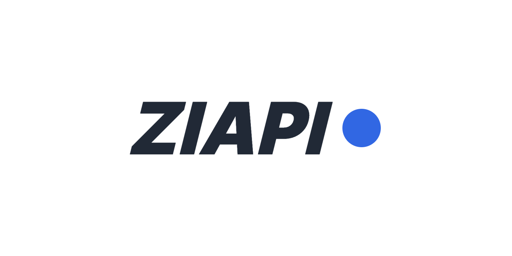

# ZIAPI



[](https://github.com/martin-olivier/ZiAPI/releases/tag/v1.0.0)
[](https://isocpp.org/)
[](https://discord.gg/ztptguX2sE)
[](https://github.com/martin-olivier/ZiAPI/actions/workflows/CI.yml)

Welcome to the **ZIAPI** repository which contains the interfaces and concrete implementations that make up our API.

[**ZIAPI Official Website**](https://ziapi.vercel.app)  
[**ZIAPI Official Discord**](https://discord.gg/ztptguX2sE)

## Documentation

You can find the documentation for the **ZIAPI** in our [documentation section](docs/README.md).

Here are the most useful doc pages for starting out:
- [Getting started](docs/general/GETTING_STARTED.md)
- [Install and build guide](docs/guides/INSTALL_AND_BUILD.md)
- [Module interfaces](docs/general/MODULES.md)

## Usage

### Fetch ZiAPI using CMake

Add the following content to your CMakeLists to fetch the API and include its header files in your project:
```cmake
include(ExternalProject)

ExternalProject_Add(
    ziapi
    GIT_REPOSITORY  https://github.com/martin-olivier/ZiAPI.git
    GIT_TAG         v1.0.0
    INSTALL_COMMAND ""
    TEST_COMMAND    ""
)

add_dependencies(zia ziapi)
ExternalProject_Get_Property(ziapi SOURCE_DIR)
include_directories(${SOURCE_DIR}/include)
```

> :bulb: Don't forget to link with `libdl` on Unix is you use `dylib`:
```cmake
if(UNIX)
    target_link_libraries(zia PRIVATE dl)
endif()
```

## Authors

 - [Martin Olivier](https://github.com/martin-olivier)
 - [Diego Rojas](https://github.com/rojasdiegopro)
 - [Edouard Sengeissen](https://github.com/edouard-sn)
 - [Nicolas Allain](https://github.com/Nirasak)
 - [Romain Minguet](https://github.com/Romain-1)
 - [Allan Debeve](https://github.com/Gfaim)
