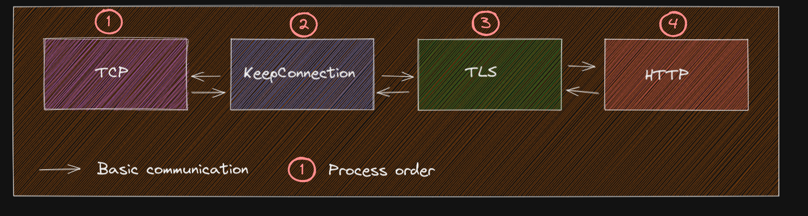

# Introduction

Ziapi is an API based on the [OSI model](https://en.wikipedia.org/wiki/OSI_model).

## Functionnality

We link our API to the layers that are accessible to us.
- Transport
- Session
- Presentation
- Application

With this implementation, you are able to plug any module at any step of the network processing.

## Modules

Here is the list of features modules are able to do:

- The modules are able to communicate with each other by registering to events / callback functions.
- The modules are able to be plugged on the layer you want. 
- If the layer has multiple modules, you need to specify the order of process by setting the priority variable.
- The module are able to be loaded using shared libraries so that they could be reloaded or changed at runtime.

Here is how is scheduled the module execution

:exclamation: If you send data to a module that is ahead in this process (ex: Presentation to Transport), it will reprocess all modules that depends on it until it reaches the last module.

Check examples if you want to have implementations or want to know about how modules are constructed and linked together.

Comment on gère les erreurs ? (ex: ça pète dans Presentation)