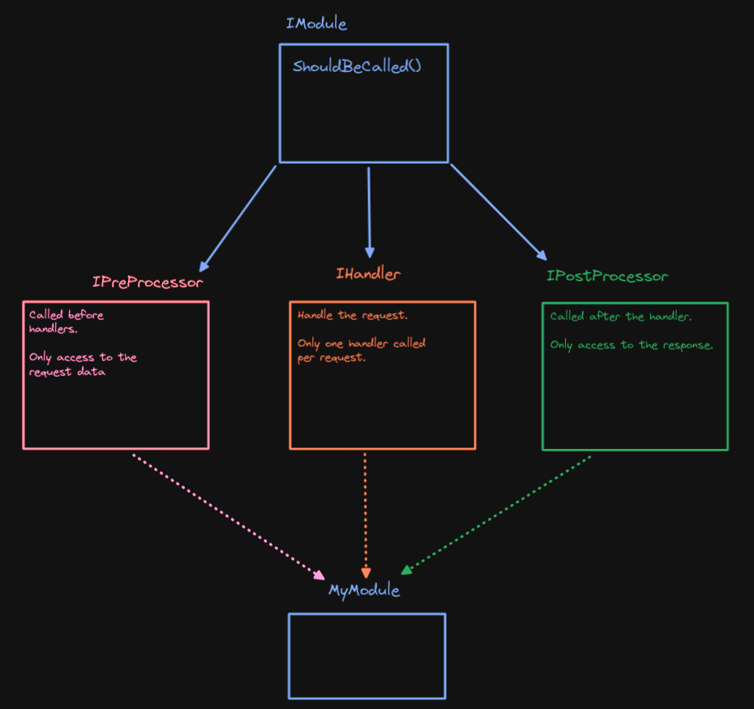
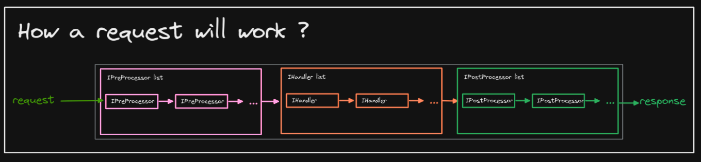

# Introduction

Ziapi is an API based on the [OSI model](https://en.wikipedia.org/wiki/OSI_model) and links itself to the last 4 layers.

## Functionnality

The 4 layers which we link the API to are (in order) : 
- `Transport` : Tells how data is transfered, for instance UDP or TCP protocol.
- `Session` : Manages connections, for example how long the server should keep a connection alive.
- `Presentation` : Ensures data usability and translate (encrypts/decrypts) data if needed.
- `Application` : Where basic modules go. Human-computer operations happen here.

In our implementation, the `Presentation` layer is contained inside the `Application` one. We'll consider that data usability check modules and  security ones belongs in the Application layer.

With this implementation, you are able to plug any module at any step of the network processing.

## Modules

The module interface (`IModule`) defines a function `shouldBeCalled()` telling if it's ready to/can be called.

There are currently 3 types of module interface that inherits from `IModule`: 
- `IPreProcessor` : 
    - Will only have access to the request
    - There can be multiple preprocessor called for the same request
    - Example : Authentification module 
- `IHandler` : 
    - Will have access to the request and response
    - There can be only ONE hander for request
    - Example : php-cgi module
- `IPostProcessor` : 
    - Will only have access to the response
    - There can be multiple postprocessor called for the same request
    - Example : CORS module 

  
Module interfaces excallidraw

Here is the list of features modules are able to do:

- If the layer has multiple modules, you need to specify the order of process by setting the priority variable.
- The module are able to be loaded using shared libraries so that they could be reloaded or changed at runtime.

Check examples if you want to have implementations or want to know about how modules are constructed and linked together.

## Modules execution flow for a request

